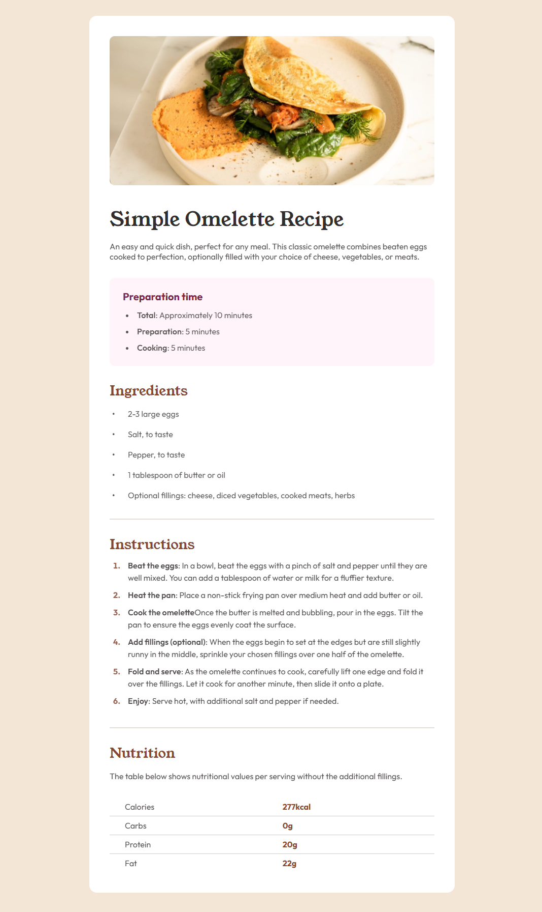

# Frontend Mentor - Recipe Page Solution

This is a solution to the [Recipe page challenge on Frontend Mentor](https://github.com/frontendmentorio/recipe-page/tree/main). Frontend Mentor challenges help you improve your coding skills by building realistic projects.

## Table of contents

- [Overview](#overview)
  - [The challenge](#the-challenge)
  - [Screenshot](#screenshot)
  - [Links](#links)
- [My process](#my-process)
  - [Built with](#built-with)
  - [What I learned](#what-i-learned)
  - [Continued development](#continued-development)
- [Author](#author)

## Overview

### The challenge

Users should be able to:

- View the optimal layout for the interface depending on their device's screen size.
- See hover and focus states for all interactive elements on the page.

### Screenshot



### Links

- Solution URL: [GitHub Repository](https://github.com/allasas11/web-fundamentals-showcase)
- Live Site URL: [Live Demo](https://allasas11.github.io/web-fundamentals-showcase/02-recipe-page/)

## My process

### Built with

- Semantic HTML5 markup
- CSS Custom Properties (Variables)
- Flexbox
- CSS Grid (for the main showcase gallery)
- **Modern CSS Nesting** - Optimized for readability and maintenance.
- Mobile-first workflow

### What I learned

In this project, I focused on mastering HTML tables and complex typography scales. I also implemented modern CSS nesting to keep the stylesheet organized.

One of the key technical highlights was managing the nutrition table's layout using specific nth-child selectors:

```css
.nutrition_table td:first-child {
    width: 52%;
    padding-left: 30px;
    color: var(--text-main-color);
    opacity: 0.85;
}